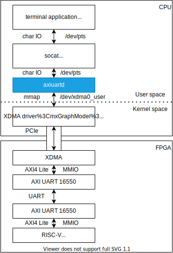

# User mode AXI UART driver

## 概要

ユーザーモードからXilinx AXI UART 16550 IPのレジスタを操作して、指定した端末とのブリッジ処理を行うドライバ。

PCIeなどでホストと接続されたFPGA上にあるAXI UART 16550コアのレジスタを XDMAドライバが提供するPCIe経由でのAXI4 Liteアクセス機能を用いてユーザーモードから制御し、FPGA内部とUART通信を行う。

また、 `socat` を使った疑似端末ブリッジを用いて、ターミナルアプリケーションとの入出力を行い。その内容を相互に橋渡しを行う。

## ライセンス

BSL-1.0